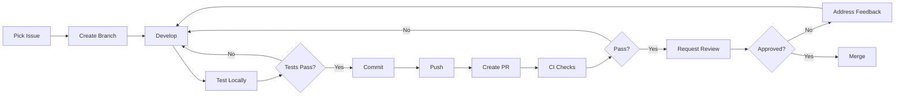

# AI Agent Guidelines & Guardrails

## Document Purpose
This document establishes strict guidelines, guardrails, and best practices for AI agents working on the Cool Track landing page project. All AI agents MUST adhere to these guidelines to ensure code quality, consistency, and project success.

---

## Table of Contents
1. [Core Principles](#core-principles)
2. [Code Standards](#code-standards)
3. [Git Workflow](#git-workflow)
4. [Quality Assurance](#quality-assurance)
5. [Communication Protocol](#communication-protocol)
6. [Prohibited Actions](#prohibited-actions)
7. [Decision-Making Framework](#decision-making-framework)

---

## Core Principles

### Principle 1: Clarity Over Cleverness
- Write code that is easy to understand, not just functional
- Prioritize readability and maintainability
- Document complex logic with clear comments
- Use descriptive variable and function names

### Principle 2: Test Before Commit
- Always test changes in multiple browsers
- Verify responsive behavior at all breakpoints
- Check accessibility with automated tools
- Validate HTML/CSS before committing

### Principle 3: Follow the Plan
- Review assigned GitHub issue before starting work
- Complete work within the defined scope
- Do not introduce unrelated changes
- Update issue status as work progresses

### Principle 4: Performance First
- Optimize all assets before adding to project
- Lazy load images and non-critical resources
- Minimize CSS and JavaScript
- Aim for Lighthouse scores > 90

### Principle 5: Accessibility is Non-Negotiable
- Every component must be keyboard accessible
- Maintain proper heading hierarchy
- Provide alt text for all images
- Ensure minimum 4.5:1 color contrast

---

## Code Standards

### HTML Standards

**REQUIRED:**
```html
<!-- ✓ Semantic HTML5 elements -->
<header>, <nav>, <main>, <section>, <article>, <aside>, <footer>

<!-- ✓ Proper document structure -->
<!DOCTYPE html>
<html lang="en">
<head>
  <meta charset="UTF-8">
  <meta name="viewport" content="width=device-width, initial-scale=1.0">
  <title>Page Title - Cool Track</title>
</head>

<!-- ✓ Accessible forms -->
<label for="email">Email Address</label>
<input type="email" id="email" name="email" required>

<!-- ✓ Responsive images -->

```

**PROHIBITED:**
```html
<!-- ✗ Inline styles -->
<div style="color: red;">Don't do this</div>

<!-- ✗ Non-semantic divs when semantic elements exist -->
<div class="header">...</div> <!-- Use <header> instead -->

<!-- ✗ Missing alt text -->
 <!-- Always include alt -->

<!-- ✗ Deprecated elements -->
<center>, <font>, <marquee>
```

### CSS Standards

**File Organization:**
```
assets/css/
├── main.css              # Main stylesheet (imports others)
├── variables.css         # CSS custom properties
├── base.css             # Reset, typography, base elements
├── layout.css           # Grid, container, sections
├── components/          # Individual components
│   ├── navigation.css
│   ├── hero.css
│   ├── cards.css
│   ├── forms.css
│   └── buttons.css
└── utilities.css        # Utility classes
```

**Naming Convention (BEM):**
```css
/* Block */
.card { }

/* Element */
.card__title { }
.card__description { }

/* Modifier */
.card--featured { }
.card--large { }

/* State (with prefix) */
.is-active { }
.has-error { }
```

**CSS Custom Properties (Required):**
```css
:root {
  /* Colors */
  --color-primary: #0066CC;
  --color-secondary: #FF6B35;
  --color-success: #28A745;
  --color-text: #212529;
  --color-background: #FFFFFF;
  
  /* Spacing */
  --spacing-xs: 0.5rem;
  --spacing-sm: 1rem;
  --spacing-md: 1.5rem;
  --spacing-lg: 2rem;
  --spacing-xl: 3rem;
  
  /* Typography */
  --font-heading: 'Inter', sans-serif;
  --font-body: 'Open Sans', sans-serif;
  --font-size-base: 1rem;
  --line-height-base: 1.6;
  
  /* Breakpoints */
  --breakpoint-mobile: 320px;
  --breakpoint-tablet: 768px;
  --breakpoint-desktop: 1024px;
}
```

**Mobile-First Approach (Required):**
```css
/* ✓ CORRECT: Start with mobile, enhance for larger screens */
.component {
  /* Mobile styles first */
  font-size: 1rem;
  padding: 1rem;
}

@media (min-width: 768px) {
  .component {
    font-size: 1.125rem;
    padding: 1.5rem;
  }
}

@media (min-width: 1024px) {
  .component {
    font-size: 1.25rem;
    padding: 2rem;
  }
}
```

**Prohibited CSS:**
```css
/* ✗ Don't use !important unless absolutely necessary */
.class { color: red !important; }

/* ✗ Don't use inline styles */

/* ✗ Don't use overly specific selectors */
div.container > div.row > div.column > p { }

/* ✗ Don't use fixed pixel widths for layout */
.container { width: 1200px; } /* Use max-width instead */
```

### JavaScript Standards

**Code Structure:**
```javascript
// ✓ Use strict mode
'use strict';

// ✓ Use const/let, never var
const API_URL = 'https://api.cooltrack.com';
let currentPage = 1;

// ✓ Use descriptive function names
function handleFormSubmission(event) {
  event.preventDefault();
  // Implementation
}

// ✓ Use arrow functions for callbacks
elements.forEach(element => {
  element.addEventListener('click', handleClick);
});

// ✓ Use async/await for promises
async function fetchData() {
  try {
    const response = await fetch(API_URL);
    const data = await response.json();
    return data;
  } catch (error) {
    console.error('Error fetching data:', error);
  }
}

// ✓ Use template literals
const message = `Welcome to Cool Track, ${userName}!`;
```

**Required Patterns:**
```javascript
// 1. DOMContentLoaded wrapper
document.addEventListener('DOMContentLoaded', function() {
  initializeApp();
});

// 2. Error handling
function riskyOperation() {
  try {
    // Operation
  } catch (error) {
    console.error('Operation failed:', error);
    // Graceful fallback
  }
}

// 3. Form validation
function validateForm(formData) {
  const errors = [];
  
  if (!formData.email || !isValidEmail(formData.email)) {
    errors.push('Valid email is required');
  }
  
  return {
    isValid: errors.length === 0,
    errors
  };
}

// 4. Event delegation
document.addEventListener('click', function(event) {
  if (event.target.matches('.cta-button')) {
    handleCTAClick(event);
  }
});
```

**Prohibited JavaScript:**
```javascript
// ✗ No jQuery
$('.element').hide();

// ✗ No global variables (use module pattern)
var globalVar = 'bad';

// ✗ No inline event handlers in HTML
<button onclick="doSomething()">

// ✗ No document.write
document.write('<p>Bad practice</p>');

// ✗ No eval
eval('dangerous code');
```

---

## Git Workflow

### Branch Naming Convention

**Format:** `<type>/<ticket-number>-<brief-description>`

**Types:**
- `feature/` - New feature implementation
- `bugfix/` - Bug fixes
- `hotfix/` - Urgent production fixes
- `docs/` - Documentation updates
- `refactor/` - Code refactoring
- `test/` - Test additions or updates
- `style/` - CSS/styling changes

**Examples:**
```
feature/GH-15-pricing-page
bugfix/GH-42-mobile-navigation
hotfix/GH-88-form-validation
docs/GH-12-setup-instructions
style/GH-33-hero-responsive
```

### Commit Message Standards

**Format:**
```
<type>(<scope>): <subject>

<body>

<footer>
```

**Types:**
- `feat:` - New feature
- `fix:` - Bug fix
- `docs:` - Documentation
- `style:` - Formatting, missing semicolons, etc.
- `refactor:` - Code restructuring
- `test:` - Adding tests
- `chore:` - Maintenance tasks

**Examples:**
```bash
# Good commit messages
git commit -m "feat(pricing): add tiered pricing table component"
git commit -m "fix(navigation): resolve mobile menu toggle issue on iOS"
git commit -m "docs(readme): update installation instructions"
git commit -m "style(hero): improve responsive layout for tablet"

# Bad commit messages (AVOID)
git commit -m "updates"
git commit -m "fix stuff"
git commit -m "WIP"
```

### Pull Request Guidelines

**PR Title Format:** Same as commit message format

**PR Description Template:**
```markdown
## Description
Brief description of changes

## Related Issue
Closes #[issue number]

## Type of Change
- [ ] New feature
- [ ] Bug fix
- [ ] Documentation update
- [ ] Style/UI update
- [ ] Refactoring

## Checklist
- [ ] Code follows style guidelines
- [ ] Self-review completed
- [ ] Comments added for complex code
- [ ] Documentation updated
- [ ] No new warnings generated
- [ ] Tested on Chrome, Firefox, Safari
- [ ] Mobile responsive checked
- [ ] Accessibility checked (WAVE, keyboard nav)
- [ ] Lighthouse score > 90
- [ ] HTML/CSS validated

## Screenshots (if applicable)
Desktop:
Mobile:

## Testing Instructions
1. Step-by-step testing guide
2. ...

## Performance Impact
- Page load time: [before] → [after]
- Bundle size: [before] → [after]
```

**PR Review Checklist:**
Before requesting review, ensure:
1. All CI checks pass
2. No merge conflicts
3. Branch is up to date with main
4. All checklist items completed
5. Screenshots provided for UI changes
6. Testing instructions clear

### Workflow Process



**Step-by-Step:**
1. **Assign yourself** to GitHub issue
2. **Create branch** from `main` using naming convention
3. **Develop** feature according to requirements
4. **Test thoroughly** (browsers, devices, accessibility)
5. **Commit** with descriptive messages
6. **Push** to remote repository
7. **Create PR** using template
8. **Wait for CI** checks to complete
9. **Request review** from assigned reviewer
10. **Address feedback** if changes requested
11. **Merge** once approved (squash and merge)
12. **Delete branch** after merge
13. **Update issue** status to Done

---

## Quality Assurance

### Pre-Commit Checklist

Before every commit, verify:
- [ ] Code compiles/builds without errors
- [ ] No console errors in browser
- [ ] Tested in latest Chrome
- [ ] Mobile responsive (DevTools)
- [ ] No accessibility errors (WAVE browser extension)
- [ ] HTML validated (W3C validator)
- [ ] CSS validated (W3C CSS validator)
- [ ] Lighthouse performance > 90
- [ ] Code follows style guide
- [ ] Comments added where needed

### Testing Requirements

**Browser Testing Matrix:**
| Browser | Version | Priority |
|---------|---------|----------|
| Chrome | Latest | Critical |
| Firefox | Latest | Critical |
| Safari | Latest | Critical |
| Edge | Latest | High |
| Chrome Mobile | Latest | Critical |
| iOS Safari | Latest | Critical |

**Device Testing:**
- Mobile: 375px width (iPhone SE)
- Tablet: 768px width (iPad)
- Desktop: 1440px width (Standard laptop)
- Large Desktop: 1920px width

**Accessibility Testing:**
- WAVE browser extension (0 errors required)
- Keyboard navigation (all interactive elements reachable)
- Screen reader testing (NVDA/VoiceOver)
- Color contrast checker (4.5:1 minimum)
- Focus indicators visible

**Performance Testing:**
- Google Lighthouse (all metrics > 90)
- PageSpeed Insights
- WebPageTest.org (optional but recommended)

### Automated Testing

**HTML Validation:**
```bash
# Install validator
npm install -g html-validator-cli

# Validate all HTML files
html-validator --file=public/**/*.html
```

**CSS Validation:**
```bash
# Install stylelint
npm install -g stylelint stylelint-config-standard

# Validate CSS
stylelint "assets/css/**/*.css"
```

**JavaScript Linting:**
```bash
# Install ESLint
npm install -g eslint

# Run linter
eslint assets/js/**/*.js
```

**Link Checking:**
```bash
# Check for broken links
npm install -g broken-link-checker
blc http://localhost:1313 -ro
```

---

## Communication Protocol

### GitHub Issue Updates

**Update frequency:** At least once per day when working on an issue

**Status Labels:**
- `status: todo` - Not started
- `status: in-progress` - Currently working
- `status: blocked` - Waiting on dependencies
- `status: review` - Ready for review
- `status: done` - Completed

**Comment Template:**
```markdown
## Progress Update - [Date]

**Completed:**
- Item 1
- Item 2

**In Progress:**
- Item 3 (50% complete)

**Blockers:**
- None / [Description of blocker]

**Next Steps:**
- Item 4
- Item 5

**Questions:**
- [Any questions for PM or team]
```

### Asking Questions

**Before asking:**
1. Check project documentation
2. Search existing issues
3. Review code comments
4. Attempt solution yourself

**When asking:**
```markdown
## Question: [Brief description]

**Context:**
[What you're trying to accomplish]

**What I've tried:**
1. Approach 1 - Result
2. Approach 2 - Result

**Specific question:**
[Clear, specific question]

**Impact:**
[How this blocks progress]
```

### Reporting Bugs

```markdown
## Bug Report

**Description:**
[Clear description of the bug]

**Steps to Reproduce:**
1. Step 1
2. Step 2
3. Step 3

**Expected Behavior:**
[What should happen]

**Actual Behavior:**
[What actually happens]

**Environment:**
- Browser: [e.g., Chrome 120]
- OS: [e.g., macOS 14.1]
- Device: [e.g., Desktop]
- Screen size: [e.g., 1920x1080]

**Screenshots:**
[Attach screenshots]

**Console Errors:**
```
[Paste any console errors]
```

**Additional Context:**
[Any other relevant information]
```

---

## Prohibited Actions

### NEVER Do These:

1. **Code Changes:**
   - ❌ Commit directly to `main` branch
   - ❌ Force push to shared branches
   - ❌ Delete others' branches without permission
   - ❌ Commit code that doesn't compile
   - ❌ Add large files (>1MB) without optimization
   - ❌ Include personal information or API keys
   - ❌ Use copyrighted assets without license

2. **Dependencies:**
   - ❌ Add npm packages without approval
   - ❌ Use jQuery or other large libraries
   - ❌ Include unnecessary frameworks
   - ❌ Add fonts from unauthorized sources

3. **Content:**
   - ❌ Add placeholder "Lorem ipsum" text in production
   - ❌ Use stock photos without license verification
   - ❌ Include competitor brand names/logos
   - ❌ Make claims without factual basis

4. **Scope:**
   - ❌ Work on features outside assigned issue
   - ❌ Refactor code unrelated to current task
   - ❌ Change project structure without discussion
   - ❌ Modify configuration files without approval

5. **Quality:**
   - ❌ Skip testing before commit
   - ❌ Ignore accessibility requirements
   - ❌ Submit PR with failing tests
   - ❌ Leave console.log statements in production code

### Consequences:

Violations will result in:
1. PR rejection
2. Required rework
3. Code review before future PRs
4. Removal from project (severe/repeated violations)

---

## Decision-Making Framework

### When You Can Decide:

✓ **Minor styling adjustments** (spacing, alignment) within design system
✓ **Variable naming** following conventions
✓ **Code organization** within your assigned files
✓ **Bug fixes** for obvious issues
✓ **Performance optimizations** that don't change functionality

### When You Must Ask:

⚠️ **Architecture changes** affecting multiple components
⚠️ **New dependencies** or libraries
⚠️ **Significant design deviations** from mockups
⚠️ **Scope changes** beyond issue description
⚠️ **Third-party integrations** or APIs
⚠️ **Security-related** decisions
⚠️ **Breaking changes** to existing functionality

### Decision Template:

```markdown
## Decision Required

**Issue:** [What needs to be decided]

**Options:**
1. **Option A:** [Description]
   - Pros: [List]
   - Cons: [List]
   - Impact: [List]

2. **Option B:** [Description]
   - Pros: [List]
   - Cons: [List]
   - Impact: [List]

**Recommendation:** [Your recommended option]

**Reasoning:** [Why you recommend this]

**Timeline Impact:** [Does this affect timeline?]

**Request:** [Asking for approval/feedback]
```

---

## Code Review Guidelines

### As a Reviewer:

**Review Checklist:**
- [ ] Code follows style guidelines
- [ ] Functionality matches requirements
- [ ] Tests pass
- [ ] No security vulnerabilities
- [ ] Performance acceptable
- [ ] Accessibility maintained
- [ ] Documentation updated
- [ ] No unnecessary code
- [ ] Error handling present
- [ ] Browser compatibility maintained

**Review Etiquette:**
- Be constructive, not critical
- Explain the "why" behind suggestions
- Approve quickly if standards met
- Suggest, don't demand (unless critical)
- Acknowledge good work

**Comment Types:**
```markdown
<!-- Critical issue (must fix) -->
🔴 **Critical:** This will break on IE11. Use flexbox fallback.

<!-- Important suggestion (should fix) -->
🟡 **Suggestion:** Consider extracting this into a reusable function.

<!-- Nice to have (optional) -->
🟢 **Nit:** Minor formatting inconsistency here.

<!-- Positive feedback -->
⭐ **Great work:** This is a clean solution!

<!-- Question -->
❓ **Question:** Why did you choose this approach over X?
```

### As a Reviewee:

**Receiving Feedback:**
- Don't take it personally
- Ask questions if unclear
- Explain reasoning if needed
- Make requested changes promptly
- Thank reviewers for their time
- Learn from feedback

**Responding to Comments:**
```markdown
✅ Fixed in [commit hash]
💬 Good point! I've updated to use [approach]
❓ Can you clarify what you mean by [question]?
📝 I chose this because [reasoning]. Open to alternatives.
```

---

## Emergency Procedures

### Production Bug Found:

1. **Immediately:**
   - Create hotfix issue with `priority: critical` label
   - Notify product manager in issue
   - Document steps to reproduce

2. **Within 1 Hour:**
   - Create hotfix branch: `hotfix/GH-XXX-brief-description`
   - Implement minimal fix
   - Test thoroughly
   - Create PR with `HOTFIX:` prefix

3. **Review Process:**
   - Request immediate review
   - At least 2 approvals required for hotfix
   - Deploy as soon as approved

### Build Failure:

1. Check CI/CD logs
2. Attempt to reproduce locally
3. If cannot fix within 30 minutes, revert last commit
4. Create issue to investigate
5. Fix in separate branch

### Stuck on Issue:

1. **After 2 hours:** Document what you've tried, ask specific question
2. **After 4 hours:** Request pair programming session
3. **After 8 hours:** Escalate to PM for reassignment or timeline adjustment

---

## Performance Budgets

### Hard Limits (Cannot Exceed):

| Metric | Limit |
|--------|-------|
| Total page size | 2 MB |
| JavaScript bundle | 150 KB (minified) |
| CSS bundle | 50 KB (minified) |
| Largest image | 200 KB |
| Web fonts | 100 KB total |
| First Contentful Paint | 1.5s |
| Time to Interactive | 3.5s |
| Total Blocking Time | 300ms |
| Cumulative Layout Shift | 0.1 |

### Warning Thresholds:

| Metric | Warning |
|--------|---------|
| Total page size | 1.5 MB |
| JavaScript bundle | 100 KB |
| CSS bundle | 35 KB |
| Largest image | 150 KB |

**If approaching limits:**
1. Optimize before adding more
2. Consider code splitting
3. Lazy load non-critical resources
4. Compress images further
5. Remove unused code

---

## Tools & Resources

### Required Tools:

- **Code Editor:** VS Code (recommended) with extensions:
  - ESLint
  - Stylelint
  - Prettier
  - HTML Hint
  - Live Server
  
- **Browser Extensions:**
  - WAVE Accessibility Checker
  - Lighthouse
  - ColorZilla
  - Responsive Viewer

- **Testing Tools:**
  - Chrome DevTools
  - Firefox Developer Tools
  - Safari Web Inspector

### Helpful Resources:

- **Hugo Documentation:** https://gohugo.io/documentation/
- **MDN Web Docs:** https://developer.mozilla.org/
- **CSS Tricks:** https://css-tricks.com/
- **A11Y Project:** https://www.a11yproject.com/
- **Web.dev:** https://web.dev/
- **Can I Use:** https://caniuse.com/

---

## Version History

| Version | Date | Changes | Author |
|---------|------|---------|--------|
| 1.0 | 2025-11-26 | Initial guidelines | Product Manager |

---

## Acknowledgment

By working on this project, AI agents acknowledge that they have read, understood, and agree to follow these guidelines.

**Questions about these guidelines?**  
Create an issue with label `question: guidelines`

---

**Document End**
